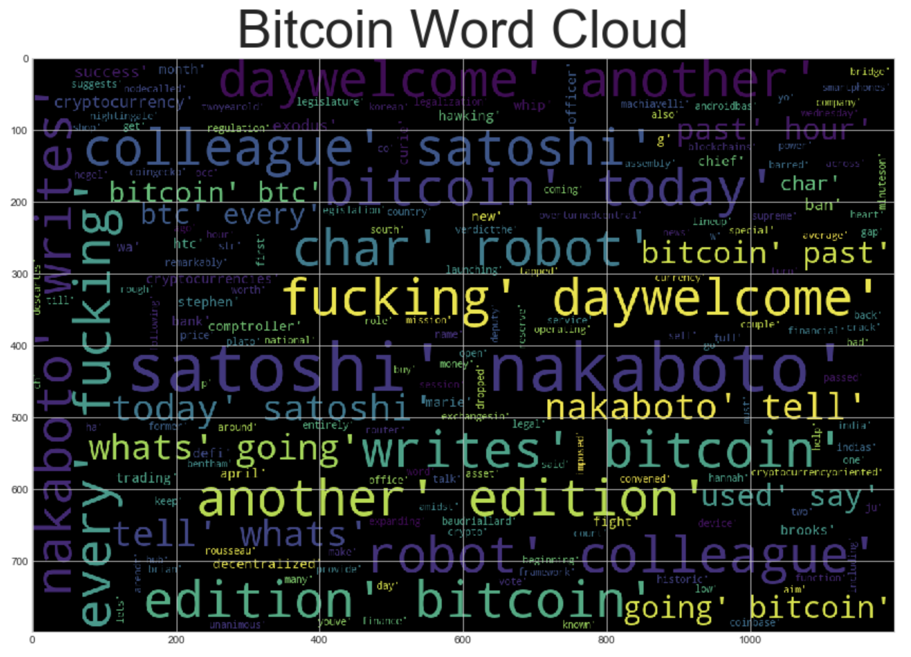

# A Tale of Two Cryptos

### _Unit 12 — NLP_

## Are Bitcoin and Ethereum real money?

Do you get confused or even emotionally disturbed by the increasing popularity on crypto currencies? You are not alone. In this homework, we are comparing two popular crypto currencies, Bitcoin and Ethereum, based on articles fetched from [News API](https://newsapi.org/). 

Conclusions are based on the following analysis:

1. [Sentiment Analysis](#Sentiment-Analysis)
2. [Natural Language Processing](#Natural-Language-Processing)
3. [Named Entity Recognition](#Named-Entity-Recognition)

### **Sentiment Analysis**

Step 1. Fetch articles on each coin from News API. The dataframes created from dictionaries for better views (click me to expand).

Step 2. Article texts are scored for their sentiments based on NLTK Vader analyzer. Each article receives a compound, negative, neutral and positive score. 

Step 3. Descriptive statistics are summarized in tables for each coin. Conclusions are drawn based on comparing average scores for each sentiment category.   

#### **Conclusions**
> _**Which coin had the highest mean positive score?**_
>   * Bitcoin has the higher mean positive score compared to ethereum, 0.074 vs. 0.065.
>
> _**Which coin had the highest negative score?**_
>    * Based on the descriptive statistics, Ethereum has the highest compound score.
>        * It topped at 0.90 vs. the maximum compound score of 0.79 from Ethereum. 
>    * On the other hand, Bitcoin has compound scores higher than Ethereum on 
>        * its average, minimum, 25th, 50th and 75th percentiles.
>
> _**Which coin had the highest positive score?**_
>    * Ethereum has the highest positive score with its maximum at 0.21 rather than the 0.14 received by Bitcoin.
>   
> Furthermore, Sentiments on Ethereum are more volatile than those for Bitcoin.
> The standard deviations are higher on Ethereum scores for compound, negative, neutral and positive texts.

#### Natural Language Processing

In order to analyze sentiments and tones further, texts in articles are tokenized by applying NLTK and Regex to tokenize the text for each coin. 

* Words in texts are put into lower cases. Punctuations and stopwords are removed. 
* `Tokens` column containing tokenized texts is added to each article in the sentiment dataframe. Please see the column on the far right. 

#### **Conclusions**
> For each coin, we create dataframes for ten most popular bigrams and words based on frequencies of appearance. The table below summarizes top 10 most commonly used pairs and single words for bitcoin and ethereum.
>
> Bitcoin gets its attention based on people especially for its inventor. The tone gears towards casual embracement based on specific words that frequently appeared. Ethereum grabs writers' attention during certain time periods. Besides, ethereum is compared to bitcoin often. The popular words and two-word combinations on ethereum convey a sense of mixed emotions. The result is consistent with our conclusion in the previous sentiment analysis that bitcoin gains a higher positive score on average. 
> 
> Other interesting findings include:
> * Bitcoin is known by itself as a brand, providing `bitcoin` and `btc` is one of the most frequent words. In comparison, ethereum needs to be introduced as `cryptocurrency` with  `bitcoin` in articles. 
> * Bitcoin is related to `robot` often while a popular context for ethereum is `debit card`. It may imply that the two cryto currenciess will be "specialized" in different fields that they have comparative advantages on in the future. 

**Top 10 Bigrams and Words**

| Rank |  BITCOIN Bigrams   |  BITCOIN Words  | ETHEREUM Bigrams | ETHEREUM Words |
|------|--------------------|-----------------|------------------|----------------|
|  1st | (satoshi, nakaboto)| bitcoin         | (fell, first) |     char          |
|  2nd | (char, robot)      |    satoshi      | (first, time) | cryptocurrency    |
|  3rd | (robot, colleague) |     nakaboto    | (debit, card) | new               |
|  4th | (colleague, satoshi)|   char         | (char, reutersbitcoin) | bitcoin  |
|  5th | (nakaboto, writes) |    going        | (reutersbitcoin, tanked) | company|
|  6th | (writes, bitcoin) |    hour          | (tanked, thursday) | first        |
|  7th | (every, fucking)  |    btc           | (thursday, fell) | fell           |
|  8th | (fucking, daywelcome)|   today        | (time, since) | ethereum         |
|  9th | (daywelcome, another)|    robot       | (since, may) | wa                |
| 10th | (another, edition)|      colleague    | (may, amid) |  coinbase

> In addition, there are more words talking about bitcoin than ethereum as shown in the detailed frequency counts below. It is expected as bitcoin is created earlier than ethereum and is the first major invention in the field of blockchain cryptocurrency. Articles are telling legends on bitcoin while facts are reported on ethereum, its little "sibling".

a. Use NLTK to produce the ngrams for N = 2. 

b. List the top 10 words for each coin.

Finally, word clouds for each coin is generated for visual comprehension. 

 
Click to see another version of bitcoin wordcloud with more words.

 
Click to see another version of ethereum wordcloud holding more words.

#### Named Entity Recognition

Entity tags are color coded in SpaCy for texts on each coin. Based on the models, more organizations including Apple and Visa are tagged for ethereum, possibly for its application on `debit card` in the above bigram analysis. Bitcoin, on the other hand, brand itself like a celebrity for its creator Satoshi Nakaboto and being `Bitcoin` itself. 

Labeled entity lists are generated for further analysis. According to the printed results, articles on bitcoin have been rendered more promptly than ethereums. It has more reviews written in `the past 24 hours` tagged under `TIME`. Please click on "Details" to view below.

### _**Discusions**_

* Output varies as News API gets updated. 
* A second add-on list of stop words may be created after generating word clouds for the first time. Word tokens can be further cleaned by removing certain high-frequency words without analytical meaning. 
* When date is included as index, most frequent bigrams and words could be displayed on time series line plots.
* [TF-IDF transform from sklean](https://scikit-learn.org/stable/modules/generated/sklearn.feature_extraction.text.TfidfTransformer.html#sklearn.feature_extraction.text.TfidfTransformer) can be used to determine the importance of `robot` to bitcoin and `card` to ethereum in specific articles.

- - -

### Coding Files

[Crypto Notebook](Answers/Code/crypto_sentiment.ipynb)

- - -
### Stored Data Files

[<bitcoin_df_csv>](Answers/Data/bitcoin_df.csv)
[<bitcoin_df_pickle>](Answers/Data/bitcoin_df.pickle)

[<ethereum_df_csv>](Answers/Data/ethereum_df.csv)
[<ethereum_df_pickle>](Answers/Data/ethereum_df.pickle)

[<bitcoin_sentiments_df_csv>](Answers/Data/bitcoin_sentiments_df.csv)
[<bitcoin_sentiments_df_pickle>](Answers/Data/bitcoin_sentiments_df.pickle)

[<ethereum_sentiments_df_csv>](Answers/Data/ethereum_sentiments_df.csv)
[<ethereum_sentiments_df_pickle>](Answers/Data/ethereum_sentiments_df.pickle)

- - - 

# References:
* CU Fintech Bootcamp GitLab Repository
* [Vader Sentiment Analysis](http://www.nltk.org/howto/sentiment.html)
* https://www.geeksforgeeks.org/python-lemmatization-with-nltk/
* https://riptutorial.com/nltk/example/27393/porter-stemmer
* https://newsapi.org/
* https://stackoverflow.com/questions/51102205/how-to-know-the-labels-assigned-by-astypecategory-cat-codes
* https://pandas.pydata.org/pandas-docs/stable/user_guide/categorical.html
* https://matplotlib.org/3.1.1/gallery/lines_bars_and_markers/bar_stacked.html#sphx-glr-gallery-lines-bars-and-markers-bar-stacked-py
* https://scikit-learn.org/stable/modules/generated/sklearn.feature_extraction.text.TfidfTransformer.html#sklearn.feature_extraction.text.TfidfTransformer
